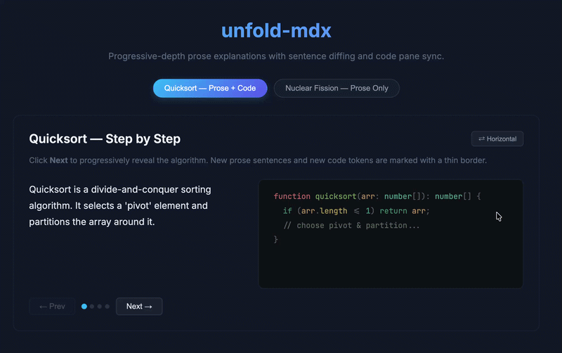

# @unfold-mdx/react

Progressive-depth prose & code explanations for React + MDX.



Write full text and code snapshots at each depth level — the library diffs consecutive snapshots at **sentence** and **line/token** granularity, optionally highlights what changed, and lets the reader step through at their own pace. No accordion collapses, no page navigation, no scroll-jumps.

## Features

- **Sentence-level prose diffing** — automatically detects added, modified, and equal sentences between steps
- **Line & token-level code diffing** — detects added lines, changed lines (with inline token diffs), and equal lines
- **Opt-in Shiki syntax highlighting** — `unfold-mdx/shiki` adapter colors your code with any Shiki theme
- **Headless by default** — ships zero CSS; every element uses `data-*` attributes you can target freely
- **Opinionated theme included** — `import 'unfold-mdx/theme.css'` for a polished dark-mode starting point
- **SSR / no-JS fallback** — renders the deepest level server-side; hydrates to interactive on the client
- **Controlled & uncontrolled** — use `defaultIndex` for fire-and-forget, or `selectedIndex` + `onChange` for full control
- **Accessible** — ARIA labels, `aria-live` regions, `role="tablist"` indicators, `prefers-reduced-motion` support
- **Tiny** — ~13 KB ESM, only `diff-match-patch` as a runtime dependency

---

## Installation

```bash
npm install unfold-mdx
# or
pnpm add unfold-mdx
# or
yarn add unfold-mdx
```

### Peer Dependencies

| Package     | Version  | Required? |
|-------------|----------|-----------|
| `react`     | ≥ 18     | ✅ Yes     |
| `react-dom` | ≥ 18     | ✅ Yes     |
| `shiki`     | ^1.0.0   | ❌ Optional |

---

## Quick Start

```tsx
import { Depth, DepthLevel, DepthCode } from "unfold-mdx";
import "unfold-mdx/theme.css"; // optional — opinionated dark theme

export default function Demo() {
  return (
    <Depth show="both" orientation="horizontal" indicators buttonVariant="arrow">
      <DepthLevel label="Overview">
        Quicksort is a divide-and-conquer sorting algorithm.
        It selects a 'pivot' element and partitions the array around it.
      </DepthLevel>
      <DepthCode lang="typescript">
{`function quicksort(arr: number[]): number[] {
  if (arr.length <= 1) return arr;
}`}
      </DepthCode>

      <DepthLevel label="Partitioning">
        Quicksort is a divide-and-conquer sorting algorithm.
        It selects a 'pivot' element and partitions the array around it.
        Elements smaller than the pivot go left; larger ones go right.
      </DepthLevel>
      <DepthCode lang="typescript">
{`function quicksort(arr: number[]): number[] {
  if (arr.length <= 1) return arr;

  const pivot = arr[arr.length - 1];
  const left = arr.filter((x) => x < pivot);
  const right = arr.filter((x) => x > pivot);
}`}
      </DepthCode>
    </Depth>
  );
}
```

Click **Next** → the library diffs the two snapshots and renders only the current step, marking new sentences and code lines.

---

## Adding Shiki Syntax Highlighting

```tsx
import { Depth, DepthLevel, DepthCode } from "unfold-mdx";
import { createShikiHighlighter } from "unfold-mdx/shiki";
import "unfold-mdx/theme.css";

// Create once at module scope
const highlighter = createShikiHighlighter({
  theme: "vitesse-dark",
  langs: ["typescript"],
});

export default function Demo() {
  return (
    <Depth show="both" highlighter={highlighter} indicators>
      {/* ...steps... */}
    </Depth>
  );
}
```

Shiki loads asynchronously. Before it's ready, code renders with the raw diff tokens (no colors). Once loaded, the component re-renders with full syntax coloring — no layout shift.

---

## API Reference

### `<Depth>` Props

| Prop | Type | Default | Description |
|------|------|---------|-------------|
| `selectedIndex` | `number` | — | Controlled mode: current step index (0-based). |
| `defaultIndex` | `number` | `0` | Uncontrolled mode: initial step index. |
| `onChange` | `(i: number) => void` | — | Callback when the step changes. |
| `orientation` | `"horizontal" \| "vertical"` | `"horizontal"` | Pane layout direction (when `show="both"`). |
| `ratio` | `number` | `0.5` | Prose/code width split (0–1). Exposed as `--unfold-ratio`. |
| `show` | `"both" \| "prose" \| "code"` | `"both"` | Which panes to render. |
| `indicators` | `boolean` | `false` | Show clickable step-indicator dots. |
| `buttonVariant` | `"text" \| "arrow" \| "chevron" \| "minimal"` | `"text"` | Navigation button label style. |
| `animate` | `boolean` | `true` | Set `data-enter="true"` for one frame on new elements. |
| `highlight` | `boolean` | `true` | Mark added/changed elements with `data-sentence="added"` / `data-code-line="added"`. Set `false` to disable all visual diff markers. |
| `highlighter` | `ShikiHighlighter` | — | Shiki adapter instance from `createShikiHighlighter()`. |

### `<DepthLevel>` Props

| Prop | Type | Description |
|------|------|-------------|
| `label` | `string` | Human-readable step name (used in ARIA labels and indicators). |
| `children` | `ReactNode` | Full prose snapshot for this step. |

### `<DepthCode>` Props

| Prop | Type | Description |
|------|------|-------------|
| `lang` | `string` | Language identifier (e.g. `"typescript"`, `"python"`). |
| `label` | `string` | Optional label for the code pane. |
| `children` | `string` | Full raw code string for this step. |

---

## Styling

### Headless (default)

`unfold-mdx` renders plain HTML with `data-*` attributes. You style everything yourself:

```css
/* Prose highlights */
[data-sentence="added"]  { border-left: 2px solid #3b82f6; padding-left: 8px; }
[data-sentence="equal"]  { /* normal text */ }

/* Code line highlights */
[data-code-line="added"],
[data-code-line="changed"] { background: rgba(59, 130, 246, 0.08); }
[data-code-line="equal"]   { /* normal code */ }

/* Controls */
[data-unfold-controls] { display: flex; gap: 12px; margin-top: 16px; }
[data-unfold-dot][data-active="true"] { background: #3b82f6; }

/* Enter animation */
[data-enter="true"] { animation: flash 0.4s ease-out; }
@keyframes flash {
  from { background-color: rgba(59, 130, 246, 0.15); }
  to   { background-color: transparent; }
}
```

### Opinionated Theme

```tsx
import "unfold-mdx/theme.css";
```

Override any design token with CSS custom properties:

| Variable | Default | Description |
|----------|---------|-------------|
| `--unfold-ratio` | `0.5` | Prose/code split |
| `--unfold-prose-color` | `#e2e8f0` | Prose text color |
| `--unfold-code-bg` | `#0d1117` | Code pane background |
| `--unfold-code-border` | `rgba(56,189,248,0.15)` | Code pane border |
| `--unfold-code-text` | `#c9d1d9` | Code fallback text |
| `--unfold-highlight` | `rgba(56,189,248,0.5)` | Highlight border color |
| `--unfold-highlight-bg` | `rgba(56,189,248,0.06)` | Highlight background |
| `--unfold-btn-bg` | `rgba(255,255,255,0.06)` | Button background |
| `--unfold-btn-border` | `rgba(255,255,255,0.12)` | Button border |
| `--unfold-btn-text` | `#e2e8f0` | Button text |
| `--unfold-btn-hover-bg` | `rgba(255,255,255,0.12)` | Button hover background |
| `--unfold-dot-bg` | `rgba(255,255,255,0.15)` | Inactive dot |
| `--unfold-dot-active` | `#38bdf8` | Active dot |

---

## DOM Output

```html
<div data-unfold-root data-orientation="horizontal" data-show="both"
     data-level="1" data-total-levels="3"
     role="region" aria-label="Partitioning"
     style="--unfold-ratio: 0.5;">
  <div data-unfold-panes>
    <div data-unfold-pane="prose" aria-live="polite">
      <span data-sentence="equal">Quicksort is a divide-and-conquer sorting algorithm. </span>
      <span data-sentence="equal">It selects a 'pivot' element... </span>
      <span data-sentence="added" data-enter="true">Elements smaller than the pivot go left; larger ones go right. </span>
    </div>
    <div data-unfold-pane="code" aria-live="polite">
      <pre data-lang="typescript">
        <code>
          <span data-code-line="equal"><span data-code-token="equal" style="color:#CB7676">function</span>...</span>
          <span data-code-line="added" data-enter="true"><span data-code-token="added" style="color:#BD976A">const</span>...</span>
        </code>
      </pre>
    </div>
  </div>
  <div data-unfold-controls data-button-variant="arrow">
    <button data-unfold-prev aria-disabled="false">← Prev</button>
    <div data-unfold-indicators role="tablist">
      <button data-unfold-dot role="tab" aria-selected="false"></button>
      <button data-unfold-dot role="tab" aria-selected="true" data-active="true"></button>
      <button data-unfold-dot role="tab" aria-selected="false"></button>
    </div>
    <button data-unfold-next aria-disabled="false">Next →</button>
  </div>
</div>
```

---

## SSR / No-JS Fallback

`<Depth>` renders all children server-side with `data-unfold-active` on the deepest level. Add this CSS to hide inactive levels before hydration:

```css
[data-unfold-root] > [data-depth-level]:not([data-unfold-active]),
[data-unfold-root] > pre[data-lang]:not([data-unfold-active]) {
  display: none;
}
```

This is included in `theme.css` by default.

---

## Standalone Diff Utilities

The diff engine is available as a separate entry point for use outside of React:

```ts
import { sentenceDiff, codeDiff, tokenize } from "unfold-mdx/diff";

const prose = sentenceDiff(
  "The sky is blue.",
  "The sky is blue. The grass is green."
);
// => [{ kind: "equal", sentence: "The sky is blue." },
//     { kind: "added", sentence: "The grass is green." }]

const code = codeDiff(
  "const x = 1;",
  "const x = 1;\nconst y = 2;"
);
// => [{ kind: "equal", line: "const x = 1;" },
//     { kind: "added", tokens: [...] }]
```

---

## License

[MIT](./LICENSE)
